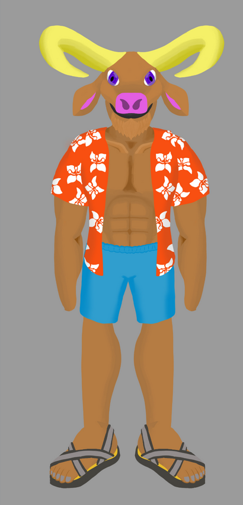

# 

  
  <iframe width="560" height="315" src="https://www.youtube.com/embed/MCEsn94BYOM?si=jGtaz3nkgHXn9X8A" title="YouTube video player" frameborder="0" allow="accelerometer; autoplay; clipboard-write; encrypted-media; gyroscope; picture-in-picture; web-share" referrerpolicy="strict-origin-when-cross-origin" allowfullscreen></iframe>

